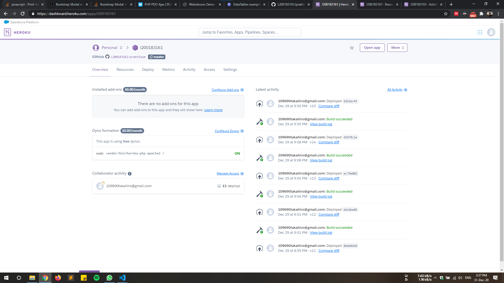
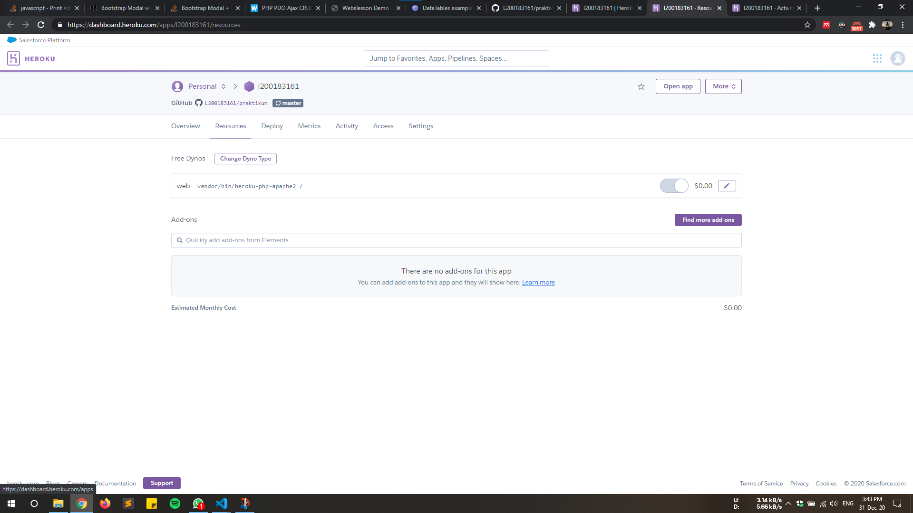
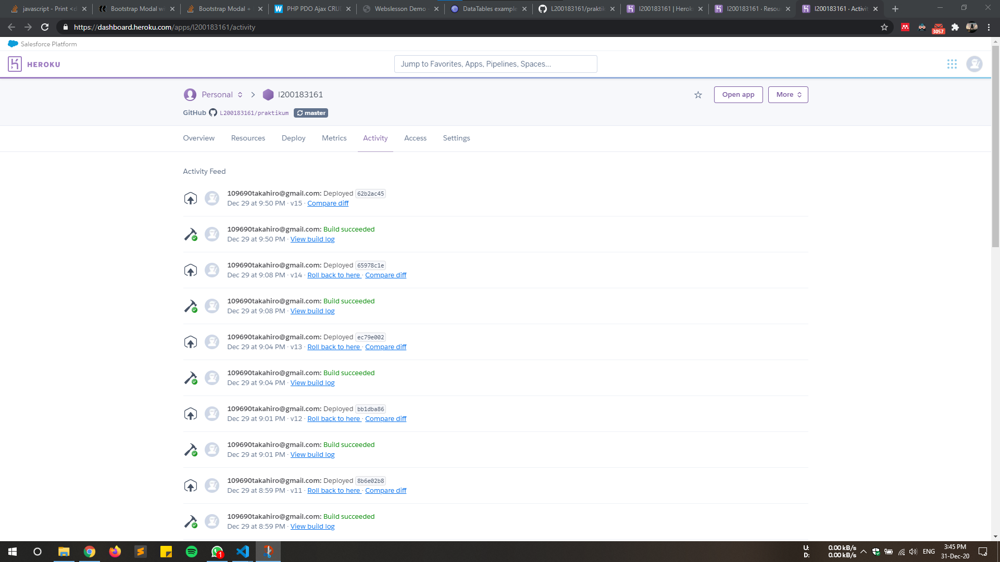

<!-- Jadi ini adalah tugas yang sebenernya cuman ngakalin gimana upload di web -->
<!-- Tapi di modul minta sekalian deploy semua website. yo apa to lur lur. modul wes lawas ora ndang diganti ki yo kepok dewe -->

#### Donny Rizal Adhi Pratama   L200183161 PraktikumPWD

# ***tolong dibaca komennya diatas dengan membuka [rawnya](https://raw.githubusercontent.com/L200183161/praktikum/master/readme.md)***
#### jadi ini kan saya pakai heroku sebagai deploynya lalu sekalian tak jadiin master nya dimari. so, kalau mau sekalian lihat gimana uploadnya ya tinggal `git push origin master` atau `git push heroku master`

##### Screenshot Heroku dashboard

